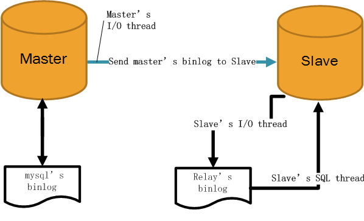
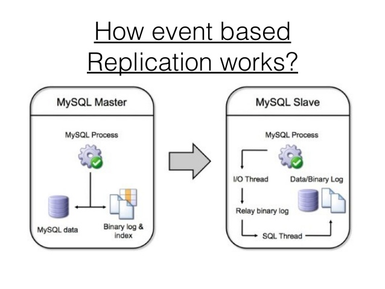

# Master-Slave Replication: MySQL-5.7 


This document expains the step-by-step process to  
&nbsp;&nbsp;&nbsp;&nbsp;&nbsp;&nbsp;&nbsp;&nbsp; a.  [Create Master-Slave Replication](#create-master-slave-replication)  
&nbsp;&nbsp;&nbsp;&nbsp;&nbsp;&nbsp;&nbsp;&nbsp; b.  [Pause Replication](#temporarily-pausedisable-the-replication)  
&nbsp;&nbsp;&nbsp;&nbsp;&nbsp;&nbsp;&nbsp;&nbsp; c.  [Resume Replication](#temporarily-pausedisable-the-replication)  
&nbsp;&nbsp;&nbsp;&nbsp;&nbsp;&nbsp;&nbsp;&nbsp; d.  [Disable Replication](#permanently-disable-the-replication)  
&nbsp;&nbsp;&nbsp;&nbsp;&nbsp;&nbsp;&nbsp;&nbsp; e.  [Restore Database](#database-restoration)  





---

## Create Master-Slave Replication:
### Step 1: Master Database Configuration:
1. #### Open MySql Configuration File
```vim
  sudo vi /etc/mysql/my.cnf
```
&nbsp;&nbsp;&nbsp;&nbsp;&nbsp;&nbsp;&nbsp;&nbsp; a. Add Master Server's IP Address in place of *<master_ip_address>*:
```vim
      bind-address = <master_ip_address>
```
&nbsp;&nbsp;&nbsp;&nbsp;&nbsp;&nbsp;&nbsp;&nbsp; b. Uncomment/Insert below lines:
```vim
      server-id = 1
      log_bin = /var/log/mysql/mysql-bin.log
```
&nbsp;&nbsp;&nbsp;&nbsp;&nbsp;&nbsp;&nbsp;&nbsp; c. Add the Master Database name in place of *<database_name>*:
```vim
      binlog_do_db = <database_name>
```

2. #### Restart Master MySql Server:
```sh
  sudo service mysql restart
```

3. #### Connect to Master MySql Database:
```mysql
  mysql -u <username> -p
```

4. #### Give rights to slave_user on Master database:
```mysql
  GRANT REPLICATION SLAVE ON *.* TO '<username>'@'%' IDENTIFIED BY '<password>';
  FLUSH PRIVILEGES;
```

5. #### Check Pointer Status and Record the values:
```mysql
  USE <database_name>;
  FLUSH TABLES WITH READ LOCK;
  SHOW MASTER STATUS
```
&nbsp;&nbsp;&nbsp;&nbsp;&nbsp;&nbsp;&nbsp;&nbsp;  * Note down the values for status response.  
&nbsp;&nbsp;&nbsp;&nbsp;&nbsp;&nbsp;&nbsp;&nbsp;  * If required, then take the backup of Master database for creating Slave using below command:
```mysql
        mysqldump -u <username> -p --opt <database_name> > /path/to/database.sql
```

6. #### Then complete the Master database configuration by releasing the Locks on tables:
```mysql
  UNLOCK TABLES;
  QUIT;
```

  
  
  


### Step 2: Slave Database Configuration:
1. #### Connect to Slave MySql Database:
```mysql
  mysql -u <username> -p
```

2. #### Create Slave Database Schema:
```mysql
  CREATE DATABASE <database_name>;
  EXIT;
```

3. #### Import the database that you previously exported from the Master:
```mysql
  mysql -u <username> -p <database_name> < /path/to/database.sql;
```

4. #### Open the MySql Configuration File:
```vim
  sudo vi /etc/mysql/my.cnf
```
&nbsp;&nbsp;&nbsp;&nbsp;&nbsp;&nbsp;&nbsp;&nbsp; a. Uncomment/Insert below line as:
```vim
      server-id = 2
      log_bin = /var/log/mysql/mysql-bin.log
      binlog_do_db = <database_name>
      relay-log = /var/log/mysql/mysql-relay-bin.log
```

5. #### Restart the Slave MySql Server:
```sh
  sudo service mysql restart
```

6. #### Connect to Slave MySql Database:
```mysql
  mysql -u <username> -p
```

7. #### Enable the replication from slave MySql (here enter the values of MASTER_LOG_FILE & MASTER_LOG_POS noted earlier from *SHOW MASTER STATUS;* query on Master Database Server):
```mysql
  CHANGE MASTER TO MASTER_HOST=<master_ip_address>, MASTER_USER='<username>', MASTER_PASSWORD='<password>', MASTER_LOG_FILE='mysql-bin.000001', MASTER_LOG_POS=107;
```

8. #### Start the Slave Server:
```mysql
  START SLAVE;
```

9. #### Check Slave Server Status:
```mysql
  SHOW SLAVE STATUS\G
```

&nbsp;&nbsp;&nbsp;&nbsp;&nbsp;&nbsp;&nbsp;&nbsp;  * If there is an issue in connecting, you can try starting slave with a command to skip over it by: 
```mysql
        SET GLOBAL SQL_SLAVE_SKIP_COUNTER = 1;
        SLAVE START;
        EXIT;
```

---

## Temporarily Pause/Disable the Replication
### Steps to Temporarily Pause/Disable the Replication on Slave Server:
1. #### Connect to Slave MySql Database:
```mysql
  mysql -u <username> -p
```

2. #### Stop the SQL Thread from Execution Relay Logs on Slave Server:
```mysql
  STOP SLAVE SQL_THREAD;
```

3. #### Now as the Slave has stopped, we can perform deployment/maintenance/etc. tasks on the Master Database. These changes will be automatically reflected on the Slave Database once you restart the Slave Server.

4. #### Restart the SQL thread again on Slave Server:
```mysql
  START SLAVE SQL_THREAD;
  EXIT;
```

---

## Permanently Disable the Replication:
### Steps to Permanently/Completely Disable the MySQL replication on Slave Server:
1. #### Connect to Slave MySql Database:
```mysql
  mysql -u <username> -p
```

2. #### Stop the SQL Thread on Slave Server:
```mysql
  STOP SLAVE;
```

3. #### Reset the SQL Thread on Slave Server:
```mysql
  RESET SLAVE ALL;
  EXIT;
```

4. #### Edit the my.cnf of Slave:
&nbsp;&nbsp;&nbsp;&nbsp;&nbsp;&nbsp;&nbsp;&nbsp;  * Edit the *my.cnf* file and remove any information (if present) which refers to *"master-..."* or *"replicate-..."* options. Sometimes you may not have anything in the *my.cnf*, since replication can be setup dynamically as well.

5. #### Restart the Slave Server:
```sh
  sudo service mysql restart
```

---

## Database Restoration:
### Steps to Restore the Master Databases from Slave Server in Replication:
1. #### Connect to Slave MySql Database:
```mysql
  mysql -u <username> -p
```

2. #### Stop the SQL Thread on Slave Server:
```mysql
  STOP SLAVE;
  EXIT;
```

3. #### Copy the database schema dump from Master to Slave Server:
```sh
  scp <remote_user>@<remote_host_ip>:/path/to/remote/database.sql /path/to/local/file;
```

4. #### Connect to Master MySql Database:
```mysql
  mysql -u <username> -p
```

5. #### Drop the Database Schema on Master Server:
```mysql
  DROP DATABASE <database_name>;
```

6. #### Re-Create Master Database Schema:
```mysql
  CREATE DATABASE <database_name>;
  EXIT;
```

7. #### Import the database that you previously exported from the Master:
```mysql
  mysql -u root -f -p <database_name> < /path/to/database.sql
```

8. #### Connect to Slave MySql Database:
```mysql
  mysql -u <username> -p
```

9. #### Drop the Database Schema on Slave Server:
```mysql
  DROP DATABASE <database_name>;
```

10. #### Create Slave Database Schema:
```mysql
  CREATE DATABASE <database_name>;
  EXIT;
```

11. #### Import the database that you previously exported from the Master:
```mysql
  mysql -u root -f -p <database_name> < /path/to/database.sql
```

12. #### Connect to Master MySql Database:
```mysql
  mysql -u <username> -p
```

13. #### Check Pointer Status and Record the values on Master Server:
```mysql
  USE <database_name>;
  SHOW MASTER STATUS;
  EXIT;
```

14. #### Connect to Slave MySql Database:
```mysql
  mysql -u <username> -p
```

15. #### Check Pointer Status and Record the values on Slave Server:
```mysql
  USE <database_name>;
  SHOW SLAVE STATUS;
  EXIT;
```

16. #### Enable the replication from slave MySql (here enter the values of MASTER_LOG_FILE & MASTER_LOG_POS noted earlier from *SHOW MASTER STATUS;* query on Master Database Server):
```mysql
  CHANGE MASTER TO MASTER_HOST=<master_ip_address>, MASTER_USER='<username>', MASTER_PASSWORD='<password>', MASTER_LOG_FILE='mysql-bin.000001', MASTER_LOG_POS=107;
```

17. #### Start the Slave Server:
```mysql
  START SLAVE;
```

18. #### Check Slave Server Status:
```mysql
  SHOW SLAVE STATUS\G
  EXIT;
```

&nbsp;&nbsp;&nbsp;&nbsp;&nbsp;&nbsp;&nbsp;&nbsp;  * Slave Status now should be similar to Master Server. Also test if Master-Slave Replication is working or not by doing some changes at any test table in Master Database; which should be reflected in Slave Database.

---

